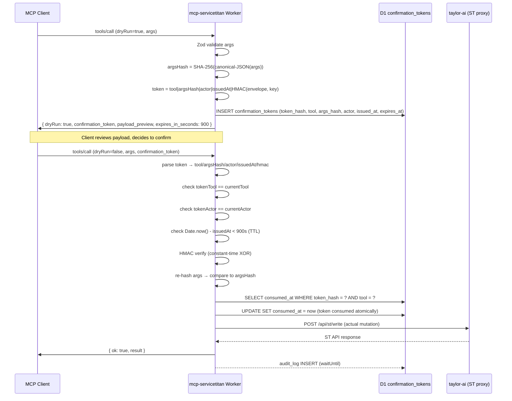

# Security Policy — mcp-servicetitan

## Vulnerability Disclosure

To report a security issue, email **lpeluso@qualityservicecompany.net** with:
- A description of the vulnerability and affected component
- Steps to reproduce (PoC preferred)
- Your assessment of severity and impact

Expected response time: 48 hours for acknowledgment, 7 days for initial triage. This is a single-tenant internal tool; the blast radius is bounded to tenant `431848990` data.

Do not open GitHub issues for security-sensitive findings.

---

## Scope

**In scope:**
- mcp-servicetitan Cloudflare Worker (this repo)
- The HMAC write-gate (dryRun → confirm flow)
- Admin route authorization (`/admin/*`)
- Tool-visibility RBAC (`X-MCP-Role` + D1 `mcp_roles`)
- Audit log integrity (`audit_log` + `error_log`)
- The taylor-ai service binding (outbound ST proxy)

**Out of scope:**
- Multi-tenant isolation — this worker is single-tenant (`431848990`). Multi-tenant is a v2 roadmap item.
- The underlying ServiceTitan API — report ST platform issues to ST directly.
- Cloudflare platform infrastructure — report via Cloudflare's own disclosure program.
- The `estimate-insight` Playwright automation — separate project, separate disclosure surface.

---

## Architecture

```
┌──────────────────────────────────────────────────────┐
│  MCP Client (Claude Desktop / VS Code / Claude Code) │
└────────────────────────┬─────────────────────────────┘
                         │  HTTPS + X-Sync-Key + X-MCP-Role
                         ▼
┌──────────────────────────────────────────────────────┐
│  mcp-servicetitan Worker                             │
│  ┌────────────────┐  ┌──────────────────────────┐    │
│  │  resolveRole() │  │  toolsForRole() filter   │    │
│  │  D1 mcp_roles  │  │  65 default / 66 admin   │    │
│  └───────┬────────┘  └─────────────┬────────────┘    │
│          │                         │                  │
│  ┌───────▼─────────────────────────▼────────────┐    │
│  │  Tool handler (Zod-validated inputs)          │    │
│  │  ┌──────────────┐  ┌────────────────────────┐ │    │
│  │  │  read tools  │  │  write tools (dryRun)  │ │    │
│  │  └──────┬───────┘  └──────────┬─────────────┘ │    │
│  └─────────│──────────────────────│───────────────┘    │
│            │                      │                  │
│     ┌──────▼──────────────────────▼──────┐           │
│     │     service binding: taylor-ai     │           │
│     └──────────────────┬─────────────────┘           │
│                        │  audit_log (waitUntil)       │
│                        │  MCP_METRICS (AE)            │
└────────────────────────│─────────────────────────────┘
                         │  X-Sync-Key + X-Correlation-Id
                         ▼
              ┌──────────────────────┐
              │  ServiceTitan API    │
              │  (tenant 431848990)  │
              └──────────────────────┘
```

---

## Threat Model (STRIDE-lite)

### Spoofing

| Surface | Defense |
|---------|---------|
| Admin route access (`/admin/*`) | `requireAdminKey()` performs a constant-time HMAC compare of `X-Sync-Key` against `env.MCP_SYNC_KEY`. Timing-safe via ephemeral-key HMAC (see `auth.ts:10-22`). |
| Admin-only tool visibility | `resolveRole()` requires: correct `X-Sync-Key` (timing-safe) **and** `X-MCP-Role: admin` header **and** a matching `admin` row in D1 `mcp_roles`. All three must be present; any mismatch degrades to `'default'` silently (MCP session stays alive with safe tool set). |
| Outbound calls to taylor-ai | `authHeaders()` attaches `X-Sync-Key` + `User-Agent: mcp-servicetitan/<version>` on every service-binding call. |

### Tampering

| Surface | Defense |
|---------|---------|
| Write args after dryRun issued | Confirmation token envelope contains `argsHash = SHA-256(canonical-JSON(args))`. `verifyToken()` re-hashes current args and compares — any single-field change fails with "args changed since dryRun." |
| Token envelope forgery | Token is `${tool}\|${argsHash}\|${safeActor}\|${issuedAt}\|${HMAC-SHA256(envelope, MCP_SYNC_KEY)}`. Forging requires possession of `MCP_SYNC_KEY`. HMAC verified constant-time via XOR loop (see `write-gate.ts:29-35`). |
| Cross-tool token replay | `verifyToken()` checks `tokenTool !== tool` before any D1 lookup — fails immediately with "for a different tool." |
| Actor injection via pipe character | Actor value is percent-encoded before inclusion in token envelope: `actor.replace(/\|/g, '%7C')`. Prevents pipe-splitting attack. |

### Repudiation

| Surface | Defense |
|---------|---------|
| Deniability of tool calls | Every tool call writes a row to D1 `audit_log` (via `execCtx.waitUntil` — non-blocking, never delays response). Fields: `operation`, `actor`, `status`, `latency_ms`, `correlation`, `ts`. |
| Write-gate activity | `confirmation_tokens` table records every `dryRun` issuance and `consumed_at` on confirm. |
| Correlation across systems | `X-Correlation-Id` propagated from MCP client → tool handler → taylor-ai → ST call → `audit_log` row. Query by correlation to reconstruct a full call chain. |

### Information Disclosure

| Surface | Defense |
|---------|---------|
| Secrets in source | `MCP_SYNC_KEY`, `TAYLOR_AI_URL`, `MCP_SERVICE_VERSION` are runtime env vars / wrangler secrets — never hardcoded. `.gitleaksignore` documents allowed test vectors. |
| Secrets in responses | Tool error envelopes contain `correlation` + short message only. No secret values, no raw ST responses with PII, no stack traces in prod. |
| Cross-request state bleed | McpServer is built **per-request** (not a shared global). CF docs note post-SDK-1.26 that a shared McpServer can bleed state across requests; we never share one. |
| D1 / AE data isolation | D1 `qsc-mcp-st` is own-DB (not shared with taylor-ai). Analytics Engine dataset `mcp_servicetitan_metrics` is CF-account scoped with no external read surface beyond the Grafana data source token (Analytics:Read only). |
| PII in `audit_log.payload` | Per the 2026-05-03 audit, `obs.redactPayload()` walks the args tree and replaces values whose key matches a PII-shaped regex (`/^phone/i`, `/Email$/i`, `/^name$/i`, `/^street/i`, `/^address/i`, `/^city$/i`, `/^zip$/i`, `/^postal/i`, `/^state$/i`, `/^note$/i`, `/^description$/i`, `/^summary$/i`, `/^body$/i`) with type-tagged tokens like `[redacted:str:N]`. Numeric IDs and ISO dates pass through. Recursion depth-capped at 6. |
| Truncation indistinguishable from short rows | `obs.jsonTruncate(value, 4000)` wraps over-cap payloads in `{ _truncated: true, _orig_length: N, _slice: '...' }` so investigators can tell truncation from missing data. Wired into both `audit_log` and `error_log`. |
| `error_log.context` absorbing arbitrary objects | `obs.safeContext(input)` allowlist-filters context keys (`status`, `tool`, `actor`, `correlation`, `correlation_id`, `latency_ms`, `code`, `failures`, `source`, `severity`, `op`, `kind`, `ms`). Dropped keys surface via `_dropped_keys` so the trail is visible. Prevents `error('msg', { env, request, args })` leak shape. |
| `read-router.queryD1` shipping non-SELECT SQL | Per the 2026-05-03 audit, `queryD1()` rejects SQL that doesn't match `^\s*SELECT\b` before any RPC call. taylor-ai's `/internal/query-d1` already enforces SELECT-only server-side; this is defense-in-depth. |

### Denial of Service

| Surface | Defense |
|---------|---------|
| Tool handler throughput | Cloudflare Workers burst limits (100k req/day free; Enterprise scales further) act as the platform-level floor. |
| Per-endpoint rate limiting | `StRateLimiter` Durable Object is scaffolded and bound (`wrangler.toml`) but not yet wired into hot-path tool handlers. Targeting v1.3. Until then, Workers platform limits are the only ceiling. |
| Confirmation token table growth | `confirmation_tokens` rows have `expires_at` column; a periodic cleanup cron (v1.3) will purge expired rows. Current risk is low — table grows proportionally to write tool usage only. |

### Elevation of Privilege

| Surface | Defense |
|---------|---------|
| Default-role caller invoking admin tool | `toolsForRole('default')` excludes `st_call`. If a default-role caller sends a `tools/call` for `st_call`, the tool is not registered on their server instance — the MCP SDK returns "tool not found" before any handler runs. |
| Admin role without key | `resolveRole()` requires the correct `X-Sync-Key` AND an `admin` row in D1. Presenting only the header is insufficient. |
| Write tool without dryRun | All write tools (`st_patch_*`, `st_create_*`, `add_*_note`, `book_job`, `assign_technicians`, etc.) require `dryRun: false` + `confirmation_token`. Calling with `dryRun: true` (default) returns the token + payload preview — no ST mutation. Calling with `dryRun: false` but no token returns an error before any outbound call. |
| `X-Actor` spoofing into upstream RBAC | Per the 2026-05-03 audit, `auth.safeActorHeader()` validates `X-Actor` against `^[a-zA-Z0-9._:-]{1,64}$` at the boundary. Invalid headers fall back to `'claude-code'` rather than passing through, so log injection (`\r\n`) and trust-gradient escalation upstream are closed off. |
| Per-tool TTL bypass on confirmation tokens | `WriteGate.dryRun` accepts a per-tool `tokenTtlMs` capped at `MAX_TOKEN_TTL_MS` (15 min). The cap can't be bypassed by passing a larger value. `WriteGate.verifyToken` reads `expires_at` from D1 (set at issue time per-tool) so a 5-min token issued by a pricebook write rejects after 5 min, even though the absolute MAX is still 15. |

---

## Write-Gate Flow



---

## Audit Posture

Every tool call — read and write — writes to D1 `audit_log` via `execCtx.waitUntil`. This is **fire-and-forget**: the audit write never blocks or delays the tool response. Fields recorded per call:

| Field | Value |
|-------|-------|
| `operation` | Tool name (e.g., `get_customer`) |
| `actor` | `X-Actor` header or `'claude-code'` default |
| `status` | `'ok'` or `'error'` |
| `latency_ms` | Wall-clock ms from handler entry to response |
| `correlation` | `X-Correlation-Id` (propagated to taylor-ai and ST) |
| `ts` | Unix ms timestamp |

Additionally, every call emits a `writeDataPoint` to the `MCP_METRICS` Analytics Engine dataset (also via `waitUntil`) for Grafana dashboarding.

Operator endpoints:
- `GET /admin/health/audit` — last-activity probe (is the pipeline live?)
- `GET /admin/metrics` — hourly/daily call counts, error rates, top tools
- `GET /admin/endpoints` — ST endpoint coverage inventory

---

## Known Limitations

These are honest gaps, not surprises. Each has a v1.3 tracking item:

1. **No per-endpoint rate limiting** — `StRateLimiter` DO is scaffolded and bound; not yet in hot path. Workers platform limits act as floor.
2. **No `/webhooks/st` HMAC ingest** — stub returns 501. ST webhooks to this worker are not yet verified or processed.
3. **No heartbeat KV emission** — liveness signal for qsc-discovery drift detector is not yet wired.
4. **No multi-tenant isolation** — single-tenant (`431848990`). Hard-coded tenant in outbound calls. Multi-tenant requires per-tenant key rotation + D1 row isolation.
5. **`CORS: origin: '*'`** — intentionally permissive for MCP Inspector dev workflow (see `index.ts:100` comment). No credentials are passed via CORS; the auth surface is the `X-Sync-Key` header which browsers can't forge cross-origin. Tightening planned for v1.3 (`H13`).
6. **`confirmation_tokens` table unbounded** — rows grow with write activity. Cleanup cron planned for v1.3.
7. **`st_call` admin escape hatch — no path-prefix allowlist** — Per the 2026-05-03 audit (F-2026-05-03-06, staged). Admin role + dryRun + confirm-token are all required, but the path is fully arbitrary so long as `normalizePath()` recognizes the ST API prefix. The `endpoint_registry` D1 table already exists at `migrations/0001_baseline.sql:88-100` to back an allowlist; population deferred to its own pass with a new `migrations/0002_st_call_allowlist.sql`.

---

## Dependency Posture

Runtime dependencies are minimal by design:

| Package | Purpose | Risk |
|---------|---------|------|
| `hono` | Routing for non-MCP routes | Low — no auth logic delegated |
| `@modelcontextprotocol/sdk` | MCP protocol implementation | Low — well-audited, Anthropic-maintained |
| `agents` (Cloudflare) | `createMcpHandler` Streamable HTTP transport | Low — CF-maintained |
| `zod` | Input validation on every tool | Low — reduces injection surface |

No database ORM, no auth library, no session framework. Crypto operations use the Web Crypto API (`crypto.subtle`) natively — no third-party crypto dependencies.
